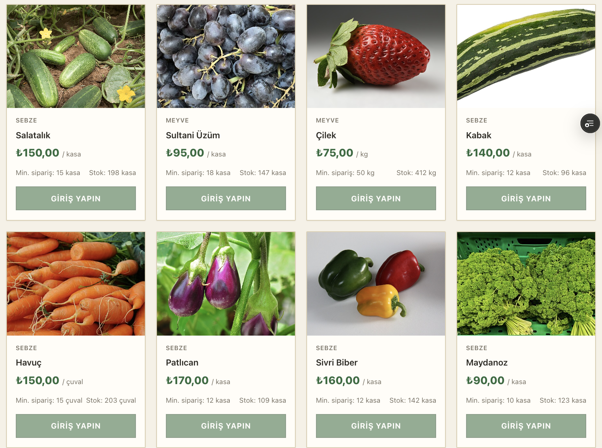
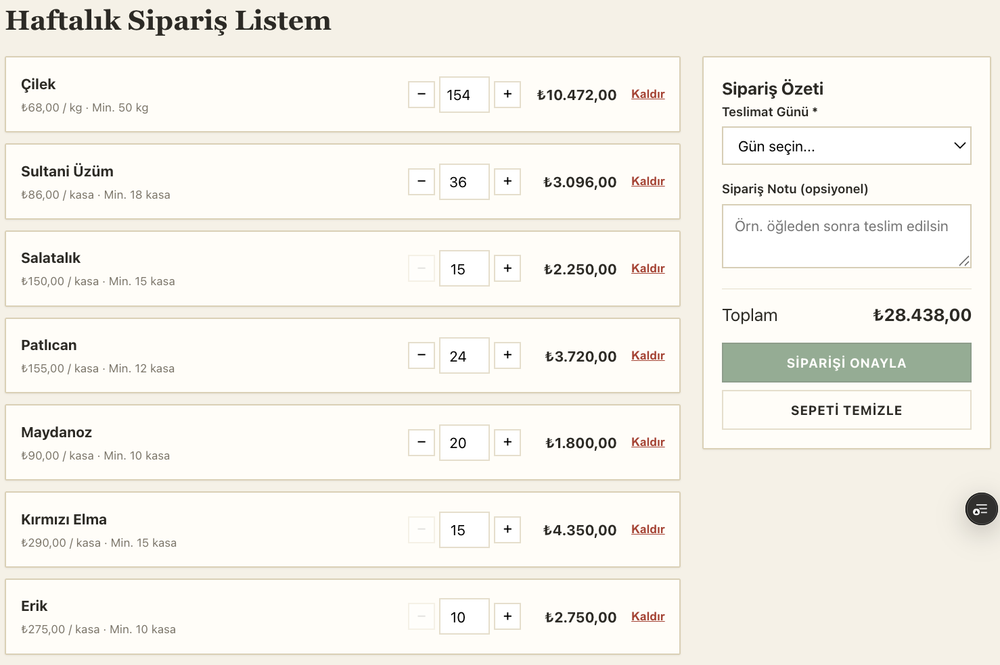
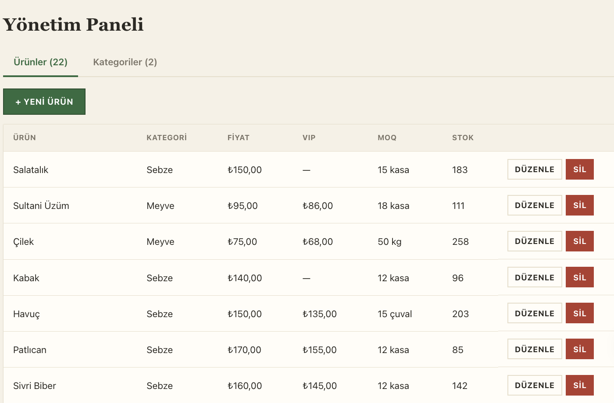

# Numan Gıda — Proje Raporu

**Taze Meyve & Sebze Toptan Sipariş Platformu — MERN Stack Full-Stack Web Uygulaması**

| | |
|---|---|
| **Ad Soyad** | Numan Baran |
| **Üniversite** | Rumeli Üniversitesi |
| **Sınıf** | 3. Sınıf |
| **Öğrenci No** | 231201048 |
| **Ders** | BLG330 — Web Programlama |
| **Tarih** | Haziran 2026 |

> Yazdırılabilir PDF sürüm: `RAPOR.pdf`

---

## 1. Proje Özeti

**Numan Gıda**, perakendecilerin bir toptancıdan taze meyve ve sebze siparişi verebildiği B2B bir web uygulamasıdır. Sistem; minimum sipariş miktarı kuralı, VIP bayilere özel fiyatlandırma, teslimat günü seçimi ve otomatik fatura üretimi gibi gerçek bir toptan satış senaryosunun ihtiyaçlarını karşılar.

Uygulama MERN Stack mimarisi olan MongoDB, Express.js, React.js ve Node.js teknolojileriyle geliştirilmiştir. Hem sunucu hem istemci tarafında çalışan, veritabanı destekli ve JWT tabanlı kimlik doğrulama içeren tam yığın bir yapıya sahiptir.

### Canlı Adresler

| Bileşen | Adres |
|---|---|
| Web Sitesi | https://stokmarket.vercel.app |
| API | https://numangida-api.onrender.com |
| Kaynak Kod | https://github.com/NumanBaran6/stokmarket |

### Demo Hesapları

Tüm hesapların şifresi: `123456`

| Rol | E-posta |
|---|---|
| Yönetici | admin@numangida.com |
| VIP Bayi | vip@numangida.com |
| Standart Bayi | bayi@numangida.com |

---

## 2. Kullanılan Teknolojiler

| Katman | Teknolojiler |
|---|---|
| Frontend | React 18, React Router 6, Vite, Axios, Context API, özgün responsive CSS |
| Backend | Node.js, Express.js 4, MVC mimarisi |
| Veritabanı | MongoDB Atlas, Mongoose 8 |
| Kimlik Doğrulama | JWT, bcryptjs |
| Yardımcı | CORS, morgan, dotenv, multer |
| Dağıtım | Vercel, Render, MongoDB Atlas |

---

## 3. Sistem Mimarisi

Üç katmanlı mimari: İstemci tarafında React, sunucu tarafında Express API ve veri katmanında MongoDB. Backend MVC benzeri yapıda; rotalar, iş mantığı ve veri modelleri ayrı katmanlara bölünmüştür.

```
server/src/  config, controllers, middleware, models, routes, utils
client/src/  api, components, context, pages, styles, utils
docs/        UML diyagramları
```

---

## 4. Backend

RESTful API; tüm HTTP metotları olan GET, POST, PUT ve DELETE, modüler router, merkezi hata yönetimi, morgan loglama, CORS ve `.env` yapılandırması.

| Metot | Yol | Erişim | Açıklama |
|---|---|---|---|
| POST | /api/auth/register | Herkese açık | Bayi kaydı |
| POST | /api/auth/login | Herkese açık | Giriş, JWT döner |
| GET | /api/auth/me | Korumalı | Profil |
| GET | /api/products | Herkese açık | Listeleme, arama ve filtre |
| GET | /api/products/:id | Herkese açık | Detay |
| POST / PUT / DELETE | /api/products/:id | Yönetici | Ürün CRUD |
| GET / POST / PUT / DELETE | /api/categories | Liste herkese, yazma Yönetici | Kategori CRUD |
| GET | /api/orders | Korumalı | Siparişler |
| POST | /api/orders | Bayi | Sipariş oluştur, MOQ ve stok kontrolü |
| PUT | /api/orders/:id/status | Yönetici | Durum güncelle |
| DELETE | /api/orders/:id | Korumalı | İptal et |
| POST | /api/upload | Yönetici | Görsel yükle |

**Middleware:** CORS, morgan, `protect`, `authorize`, `errorHandler`.

---

## 5. Veritabanı

**4 model:** User, Category, Product, Order. İlişkiler `ref` ve `populate` ile; validasyon kuralları şemalarda. ER diyagramı: [docs/er-diagram.md](docs/er-diagram.md).

- `Product.category → Category`
- `Order.customer → User`
- `Order.items[].product → Product`

---

## 6. Frontend

- **11'den fazla bileşen:** Navbar, Footer, ProtectedRoute, ProductCard, Modal, Spinner, Toast, StatusBadge, EmptyState, FormField, ReminderBanner, Logo
- **9 sayfa:** Katalog, Ürün Detay, Giriş, Kayıt, Sepet, Siparişlerim, Sipariş Detay, Yönetim, 404
- **State:** useState, useEffect, useContext — AuthContext, CartContext, ToastContext
- **Deneyim:** loading spinner, toast, modal, form validasyonu, responsive tasarım

---

## 7. Kimlik Doğrulama ve Yetkilendirme

- JWT tabanlı kimlik doğrulama; token istemcide saklanır
- bcryptjs ile şifre hashleme, düz metin tutulmaz
- Korumalı rotalar hem backend hem frontend tarafında
- Rol tabanlı erişim kontrolü; yönetici ve bayi rolleri

---

## 8. Öne Çıkan Özellikler

- **Minimum sipariş miktarı** — arayüz ve sunucu kontrolü
- **VIP fiyatlandırma** — sunucu tarafında belirlenir
- **Teslimat günü seçimi**
- **Otomatik fatura numarası**
- **Haftalık sipariş hatırlatması**
- **Stok yönetimi** — sipariş ve iptalde otomatik güncelleme
- **Görsel yükleme** — yönetim panelinden, multer ile

---

## 9. UML Diyagramları

Tüm diyagramlar `docs/` klasöründe Mermaid formatındadır:

- [Use-Case Diyagramı](docs/use-case-diagram.md)
- [Activity Diyagramı](docs/activity-diagram.md)
- [ER Diyagramı](docs/er-diagram.md)
- [Component Diyagramı](docs/component-diagram.md)

---

## 10. Canlıya Alma

| Katman | Servis |
|---|---|
| Frontend | Vercel |
| Backend | Render |
| Veritabanı | MongoDB Atlas |

Ortam değişkenleri: `VITE_API_URL`, `MONGODB_URI`, `JWT_SECRET`, `CLIENT_URL`. Her kod gönderiminden sonra otomatik yeniden dağıtım.

---

## 11. Versiyon Kontrol

- GitHub: github.com/NumanBaran6/stokmarket
- Anlamlı, özellik bazlı commit'ler
- `.gitignore` ile `node_modules` ve `.env` dışlanmış
- Düzgün `README.md`

---

## 12. Kurulum

```bash
# Backend
cd server && npm install && npm run dev   # http://localhost:5001

# Frontend
cd client && npm install && npm run dev   # http://localhost:5173
```

---

## 13. Ekran Görüntüleri

**Katalog Sayfası**



**Sepet ve Haftalık Sipariş Listesi**



**Yönetim Paneli**



---

## 14. Sonuç

Numan Gıda, MERN Stack ile geliştirilmiş; backend, frontend, veritabanı ve kimlik doğrulamayı içeren, gerçek bir B2B toptan satış senaryosunu karşılayan tam yığın bir web uygulamasıdır. Proje canlıda yayında olup, kaynak kodu GitHub'da anlamlı commit geçmişiyle erişilebilirdir.

---

*Numan Baran — 231201048 — Rumeli Üniversitesi — BLG330 Web Programlama — Haziran 2026*
