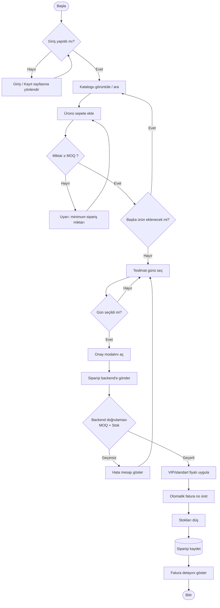

# Activity Diyagramı — Sipariş Oluşturma Akışı

Bir bayinin haftalık siparişini oluştururken izlediği akış ve sistemin
yaptığı doğrulamalar (MOQ, stok, kimlik) aşağıda gösterilmiştir.

## Akış Açıklaması

1. Kimlik doğrulama hem **frontend** (ProtectedRoute) hem **backend** (JWT middleware) tarafında yapılır.
2. **MOQ** kontrolü iki katmanda: kullanıcı arayüzünde miktar kutusu MOQ altına inmez, ayrıca backend de `quantity < product.moq` durumunu reddeder.
3. Fiyat **sunucu tarafında** kullanıcının `tier` değerine göre belirlenir (VIP indirimi istemciye bırakılmaz).
4. Sipariş başarıyla kaydedilince **stoklar düşülür** ve **fatura numarası** otomatik üretilir.
