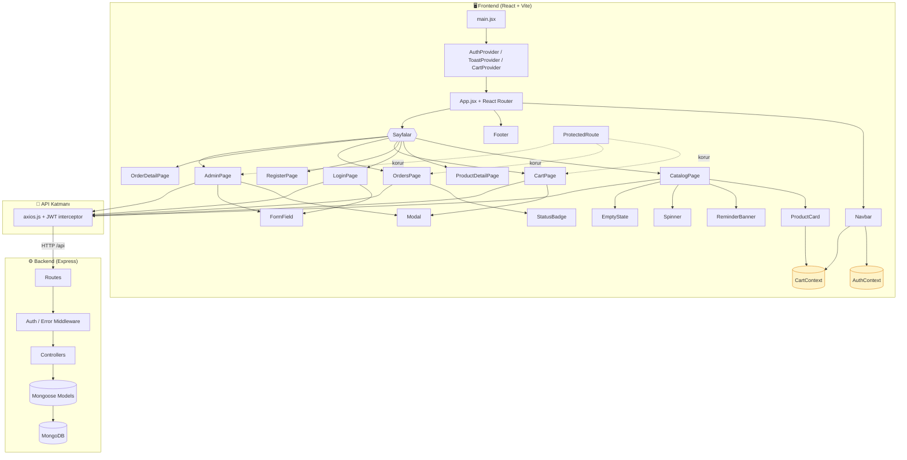

# Component (Bileşen) Diyagramı

React frontend'inin bileşen hiyerarşisi, context sağlayıcıları ve backend ile
ilişkisi aşağıda gösterilmiştir.

## Bileşen Listesi (8+)

| Bileşen | Görev |
|---------|-------|
| `Navbar` | Üst menü, rol/giriş durumuna göre linkler, sepet rozeti |
| `Footer` | Alt bilgi |
| `ProtectedRoute` | Giriş/rol kontrolü (frontend koruma) |
| `ProductCard` | Ürün kartı, VIP fiyat rozeti, sepete ekle |
| `Modal` | Genel amaçlı popup (onay, form) |
| `Spinner` | Yükleniyor göstergesi |
| `Toast` (ToastContext) | Bildirim mesajları |
| `FormField` | Etiket + input + hata mesajı sarmalayıcı |
| `StatusBadge` | Sipariş durumu etiketi |
| `EmptyState` | Boş liste durumu |
| `ReminderBanner` | Haftalık sipariş hatırlatma afişi |
