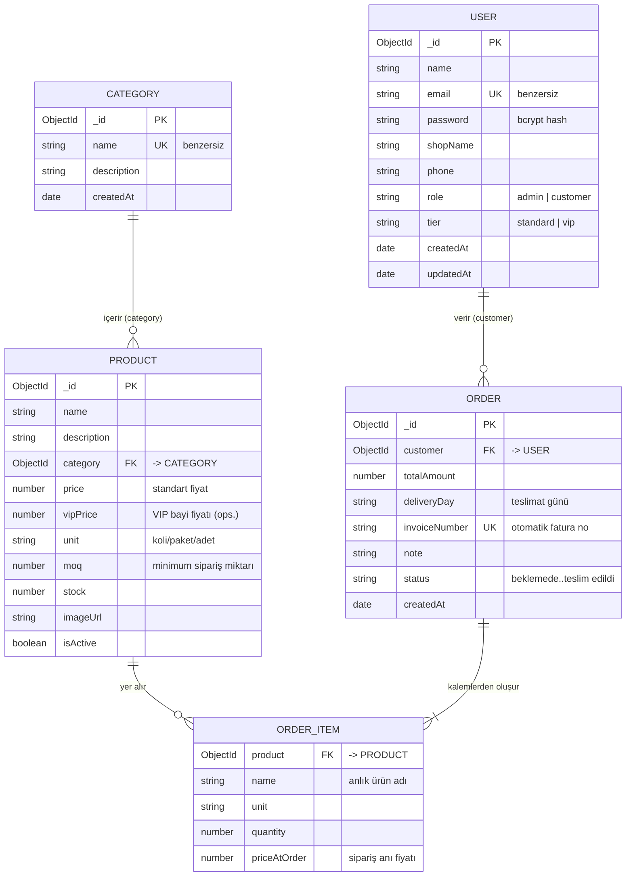

# Veritabanı ER Diyagramı (Entity-Relationship)

Numan Gıda veritabanı MongoDB üzerinde Mongoose şemaları ile modellenmiştir.
Aşağıdaki ER diyagramı modelleri ve aralarındaki ilişkileri gösterir.

## İlişkiler (ref / populate)

| İlişki | Açıklama | Mongoose |
|--------|----------|----------|
| `Product.category` → `Category` | Her ürün bir kategoriye aittir | `ref: 'Category'` + `populate` |
| `Order.customer` → `User` | Her sipariş bir bayiye aittir | `ref: 'User'` + `populate` |
| `Order.items[].product` → `Product` | Sipariş kalemleri ürünlere bağlıdır | `ref: 'Product'` |

> **Not:** `ORDER_ITEM`, `Order` dokümanı içine gömülü (embedded) bir alt-şemadır.
> Sipariş anındaki fiyat (`priceAtOrder`) saklanır; böylece ürün fiyatı sonradan
> değişse bile geçmiş faturalar değişmez.
