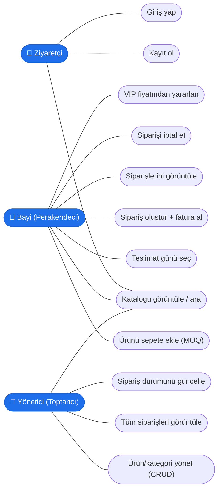

# Use-Case Diyagramı

Numan Gıda'da iki temel aktör vardır: **Bayi (Manav/Perakendeci)** ve **Yönetici (Toptancı)**.
Ziyaretçi (giriş yapmamış kullanıcı) yalnızca katalogu görüntüleyebilir.

## Aktör Yetkileri

| Use-Case | Ziyaretçi | Bayi | Yönetici |
|----------|:---------:|:----:|:--------:|
| Katalogu görüntüle / ara | ✅ | ✅ | ✅ |
| Kayıt / Giriş | ✅ | – | – |
| Sepete ekle, sipariş oluştur | – | ✅ | – |
| VIP fiyat | – | ✅ (VIP) | – |
| Kendi siparişlerini görüntüle/iptal | – | ✅ | – |
| Ürün/Kategori CRUD | – | – | ✅ |
| Tüm siparişler + durum güncelleme | – | – | ✅ |
